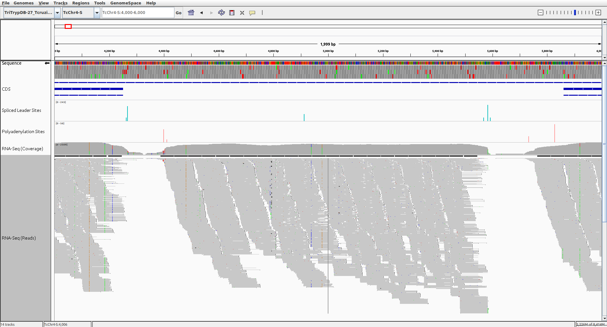

RNA-Seq UTR boundary and novel ORF detector
===========================================

Overview
--------

The script takes as input a reference genome and annotation, a bedtools
coverage map for a collection of one or more mapped samples and, optionally, a
set of spliced leader (SL) acceptor sites and polyadenylation sites, and
attempts to determine the most likely primary UTR boundaries for each gene for
which evidence exists, and also detects novel ORFs with transcription and other
types of evidence.

It is designed primarily for use with trypanasome RNA-Seq data, for which most
genes contain only a single exon, and genes exists in the genome in long tracts
on the same strand.



The above screenshot shows the basic goal of this script. Given a reference
genome with known CDS's, a set of RNA-Seq reads, and detected SL and Poly(A)
sites, can we choose the most likely primary SL/Poly(A) sites (and thus 5' and
3'UTR boundaries), for as many genes as possible?

In the above IGV screenshot, detected SL sites are shown in blue (with the
height indicating the number of RNA-Seq reads supporting that site), and the
polyadenylation sites are shown in red. While there appears to be an extended
block of mapped RNA-Seq reads between the two existing annotated CDS's, and
also potential SL and Poly(A) sites to go along with the inter-CDS coverage
region, there is currently no annotation for that region.

This script attempts to simultaneously detect novel ORFs (which may correspond
to unnanotated genes, pseudogenes, or other types of features), and assign
primary UTR boundaries to the both the novel ORFs and existing gene
annotations. This way we can arrive at a better understanding of the parasite
gene structure, and obtain more accurate distributions for 5' and 3'UTR
lengths, as well as intergenic lengths.

Requirements
------------

- [BioPython](http://biopython.org/wiki/Main_Page)
- [Numpy](http://www.numpy.org/)
- [Matplotlib](http://matplotlib.org/)
- [bcbio-gff](https://github.com/chapmanb/bcbb/tree/master/gff)
- [pybedtools](https://pythonhosted.org/pybedtools/)

Running
-------

### Input files

This script requires the following files for input:

1. Reference FASTA
2. Reference GFF
3. RNA-Seq coverage map
4. Trans-splice acceptor site GFF
5. Polyadenylation site GFF

### Construct a genome coverage map

A genome coverage map is a file which contains counts of reads at each position
in a genome, e.g.:

```
...
TcChr1-S	98	0
TcChr1-S	99	0
TcChr1-S	100	0
TcChr1-S	101	1
TcChr1-S	102	3
TcChr1-S	103	3
TcChr1-S	104	3
TcChr1-S	105	6
...
```

You can use the [bedtools
genomecov](http://bedtools.readthedocs.org/en/latest/content/tools/genomecov.html)
function to create such a map.

First, of you have multiple samples you wish you wish you use, first combine them
using [samtools view](http://www.htslib.org/doc/samtools.html):

```sh
samtools merge combined.bam */accepted_hits.bam
```

Next, call `genomecov` with the `-d` (single-nt resolution) option:

```sh
bedtools genomecov -d -ibam combined.bam | gzip > combined.coverage.gz
```

Usage Example
-------------

Example call to `rnaseq_orf_detector.py`:

```sh
./rnaseq_orf_detector.py \
    -c $SCRATCH/tcruzi-hsapiens/tophat/tcruzi/tcruzi_all_samples_sorted.coverage.gz \
    -g $REF/tcruzi_clbrener_esmeraldo-like/annotation/TriTrypDB-27_TcruziCLBrenerEsmeraldo-like.gff \
    -f $REF/tcruzi_clbrener_esmeraldo-like/genome/TriTrypDB-27_TcruziCLBrenerEsmeraldo-like_Genome.fasta \
    -s $RESEARCH/2015/110-utr-lengths/input/tcruzi_infecting_hsapiens_combined_sl_sorted.gff \
    -p $RESEARCH/2015/110-utr-lengths/input/tcruzi_infecting_hsapiens_combined_polya_sorted.gff \
    output.gff
```

Full list of command-line parameters:

```sh
usage: rnaseq_orf_detector.py [-h] -c COVERAGE -f FASTA -g GFF [-s SL_GFF]
                              [-p POLYA_GFF] -l MIN_PROTEIN_LENGTH
                              [-t PLOT_TYPE]
                              OUTFILE

Detect novel ORFs using RNA-Seq data.

positional arguments:
  OUTFILE               Location to save output GFF to

optional arguments:
  -h, --help            show this help message and exit
  -c COVERAGE, --coverage COVERAGE
                        Single nucleotide resolution genome coverage map
  -f FASTA, --fasta FASTA
                        Input genome FASTA file
  -g GFF, --gff GFF     Input genome GFF file
  -s SL_GFF, --sl-gff SL_GFF
                        Spliced leader site GFF
  -p POLYA_GFF, --polya-gff POLYA_GFF
                        Polyadenylation site GFF
  -l MIN_PROTEIN_LENGTH, --min-protein-length MIN_PROTEIN_LENGTH
                        Minimum size in amino acids allowed for novel ORFs.
                        (default=30)
  -t PLOT_TYPE, --plot-type PLOT_TYPE
                        Type of colormap to use when generating coverage
                        plots. [discrete|continuous]
```

Diagnostic Images
-----------------

TODO...


